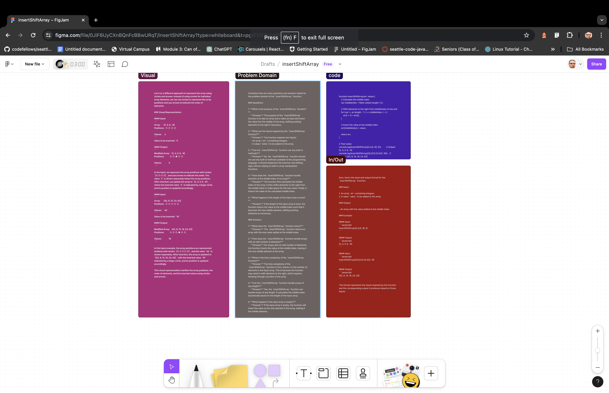

- [ x] Top-level README “Table of Contents” is updated
- [x ] README for this challenge is complete
       - [ x] Summary, Description, Approach & Efficiency, Solution
       - [x ] Picture of whiteboard
       - [x ] Link to code
- [x ] Feature tasks for this challenge are completed
- [ x] Unit tests written and passing
       - [x ] “Happy Path” - Expected outcome
       - [ x] Expected failure
       - [x ] Edge Case (if applicable/obvious)

=======
# Reverse an Array

Write a function called reverseArray which takes an array as an argument. Without utilizing any of the built-in methods available to your language, return an array with elements in reversed order.

## Whiteboard Process

## Approach & Efficiency

We reversed the array by swapping from the outside pairs inward.
<!-- What approach did you take? Why? What is the Big O space/time for this approach? -->

## Solution

No Code Required
<!-- [Code](./reverse-array.js) -->

