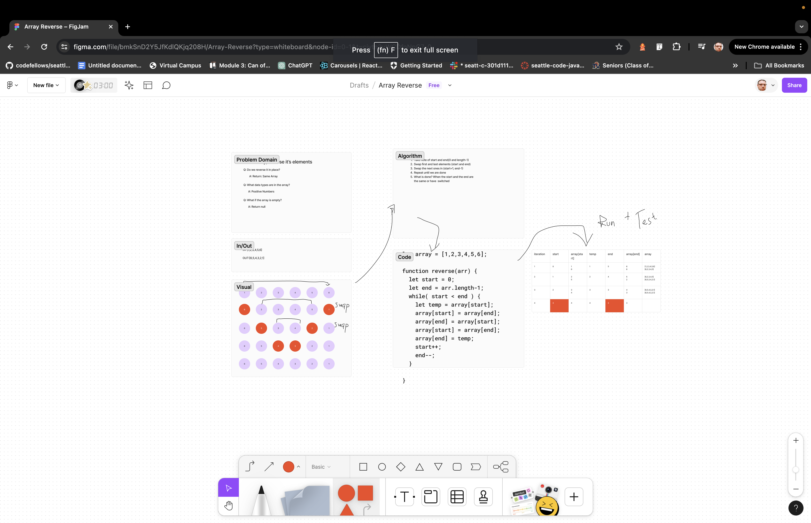

# Reverse an Array

Write a function called reverseArray which takes an array as an argument. Without utilizing any of the built-in methods available to your language, return an array with elements in reversed order.

## Whiteboard Process

## Approach & Efficiency

We reversed the array by swapping from the outside pairs inward.
<!-- What approach did you take? Why? What is the Big O space/time for this approach? -->

## Solution

No Code Required
<!-- [Code](./reverse-array.js) -->
