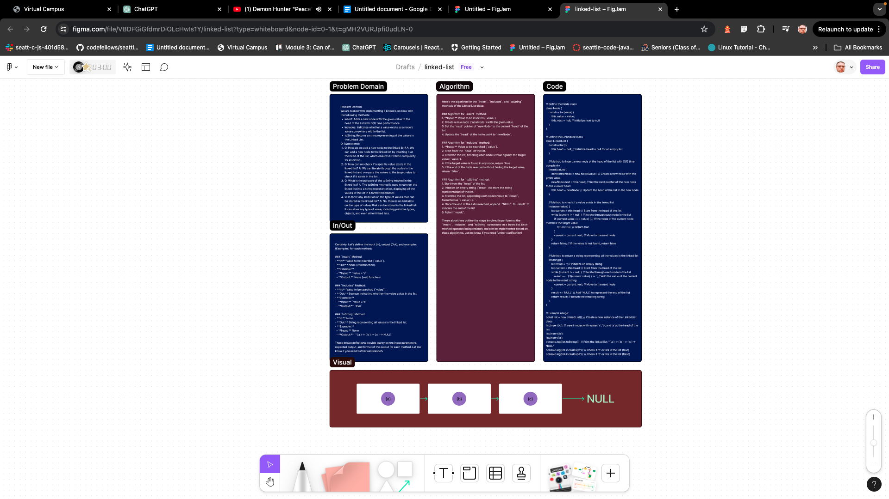

# Linked-List

## Description

This repository contains an implementation of a Linked List data structure in JavaScript. The Linked List class includes methods for insertion, searching, and converting the list to a string representation.

## Whiteboard Process

## Approach & Efficiency

### Approach

For the implementation of the Linked List, the following approach was taken:

- **Insertion:** Nodes are efficiently inserted at the head of the list using the `insert` method, resulting in O(1) time complexity.
- **Searching:** The `includes` method iterates through the nodes of the list to search for a specific value, resulting in O(n) time complexity.
- **String Representation:** The `toString` method traverses the list to create a formatted string representation of the list, resulting in O(n) time complexity.

### Efficiency

- **Time Complexity:**
  - Insertion: O(1)
  - Searching: O(n)
  - String Representation: O(n)
- **Space Complexity:** O(n) - where n is the number of nodes in the linked list.

## Solution

### How to Run the Code

To use the Linked List implementation, follow these steps:

1. Clone the repository to your local machine.
2. Include the LinkedList.js file in your project.
3. Create a new instance of the LinkedList class.
4. Use the insert method to add nodes to the list.
5. Utilize the includes method to search for values within the list.
6. Call the toString method to obtain a string representation of the linked list.

### Example

// Example usage:
const list = new LinkedList();
list.insert('c');
list.insert('b');
list.insert('a');
console.log(list.toString()); // "{ a } -> { b } -> { c } -> NULL"
console.log(list.includes('b')); // true

## Contributing

Contributions are welcome! If you have any suggestions or improvements, feel free to open an issue or create a pull request.

## License

This project is licensed under the MIT License - see the [LICENSE](LICENSE) file for details.
